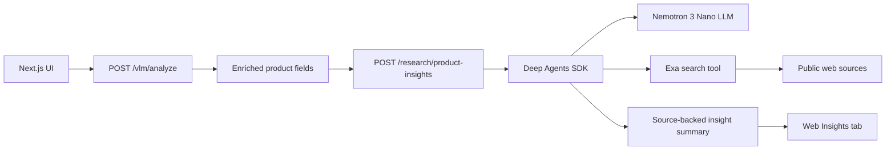

# Product Web Insights

This document describes the proposed product web research feature for Catalog Enrichment.

The feature adds a backend research endpoint and a new frontend tab that summarize public web information about a product. It uses the Deep Agents SDK from LangChain as the agent harness, Nemotron 3 Nano as the LLM, and Exa as the initial external search provider.

## Goal

After product analysis, the UI should show a **Web Insights** tab next to the **FAQs** and **Protocols** tabs. The tab helps catalog managers understand what the web says about the identified product and brand:

- common pros and cons
- practical usage patterns
- differentiators and purchase considerations
- recurring customer questions or complaints
- source-backed insights that can inform later catalog copy, FAQs, imagery, and protocol exports

This feature is informational by default. It should not automatically rewrite the enriched title, description, FAQs, or protocol schemas without a later explicit product decision.

## User Flow

1. User uploads an image and optionally enters existing product data.
2. `/vlm/analyze` enriches the product title, description, categories, tags, and colors.
3. The frontend starts web insight generation in the background using the enriched product title as the primary input.
4. The backend creates a Deep Agents research agent with an Exa-backed web search tool.
5. The agent searches first, then classifies whether source evidence supports product-specific, brand-level, category-level, or insufficient-identity research.
6. The agent searches for product, brand, or category information, gathers source snippets/text excerpts, and Nemotron synthesizes a source-backed dashboard report.
7. The UI renders the result in the **Web Insights** tab after FAQ and protocol generation have had first access to the shared LLM service.

## Architecture



## Backend Contract

### Endpoint

`POST /research/product-insights`

Content-Type: `multipart/form-data`

| Parameter | Type | Required | Description |
|-----------|------|----------|-------------|
| `title` | string | Yes | Enriched product title. Used as the primary product and brand disambiguation input. |
| `description` | string | No | Enriched product description. Used only to reduce ambiguity, not as a source of web claims. |
| `categories` | JSON string | No | Categories array from `/vlm/analyze`. |
| `tags` | JSON string | No | Tags array from `/vlm/analyze`. |
| `locale` | string | No | Regional locale code for summary language and source preference (default: `en-US`). |
| `max_results` | integer | No | Maximum Exa results the search tool should return per query (default: 8, max: 20). |

### Response Schema

```json
{
  "summary": "string",
  "pros": ["string"],
  "cons": ["string"],
  "use_cases": ["string"],
  "customer_insights": ["string"],
  "purchase_considerations": ["string"],
  "search_queries": ["string"],
  "sources": [
    {
      "title": "string",
      "url": "string",
      "published_date": "string|null",
      "snippet": "string"
    }
  ],
  "warnings": ["string"],
  "locale": "en-US",
  "research_scope": "product_specific|brand_level|category_level|insufficient_identity",
  "identity_confidence": "high|medium|low|none",
  "detected_brand": "string|null",
  "detected_model": "string|null",
  "scope_note": "string",
  "identity_evidence": ["string"],
  "report": {
    "executive_summary": "string",
    "positioning_tags": ["string"],
    "metrics": {
      "customer_sentiment": {
        "label": "Positive|Mixed|Neutral|Negative|Not enough data",
        "score": "number|null",
        "scale": "percent",
        "rationale": "string"
      },
      "build_quality": {
        "label": "string",
        "score": "number|null",
        "scale": "label",
        "rationale": "string"
      },
      "price_segment": {
        "label": "string",
        "score": null,
        "scale": "label",
        "rationale": "string"
      },
      "retail_confidence": {
        "label": "string",
        "score": "number|null",
        "scale": "rating_10",
        "rationale": "string"
      }
    },
    "retail_insights": [
      {
        "type": "positive|negative",
        "title": "string",
        "detail": "string"
      }
    ],
    "primary_use_cases": [
      {
        "title": "string",
        "detail": "string"
      }
    ],
    "customer_sentiment_summary": "string"
  }
}
```

The flat fields remain for compatibility. The UI prefers the richer `report` object when present and falls back to flat fields for older responses. The identity fields explain the research scope. Brand/model detection is not a deterministic title-token heuristic; it must be supported by returned source evidence. For generic or unbranded titles, or when the agent cannot source-confirm a brand/model, the endpoint returns `category_level` or `insufficient_identity`, clears `detected_brand`/`detected_model`, and suppresses product-specific numeric scores. The response must be source-aware. Any user-visible claim about market perception, reviews, complaints, comparisons, usage, or scores should be traceable to at least one returned source.

### Example

```bash
curl -X POST \
  -F "title=JBL Flip 6 Portable Bluetooth Speaker" \
  -F "description=A compact waterproof Bluetooth speaker with bold sound." \
  -F 'categories=["electronics"]' \
  -F 'tags=["bluetooth","speaker","portable","waterproof"]' \
  -F "locale=en-US" \
  http://localhost:8000/research/product-insights
```

## Agent Design

Use `deepagents.create_deep_agent` with:

- a configured Nemotron 3 Nano chat model
- one Exa-backed `web_search` tool for retrieval only
- a focused system prompt that asks for product research only
- a structured output repair/validation layer before returning API JSON
- dashboard metric normalization that clamps numeric scores and returns neutral values when source coverage is weak

The agent should generate and run a small set of generic queries. Do not hardcode product-specific examples in the prompt and do not infer brand identity from token position. A typical query plan can include:

- exact product and brand
- product plus `review`
- product plus `pros cons`
- product plus `how people use`
- product plus `common problems`
- product plus `price`
- product plus `customer sentiment`
- brand or manufacturer source
- category-level query when title-only search is ambiguous

When source evidence does not confirm a reliable brand or model, the agent should not guess one. It should search category-level patterns instead, such as common complaints, use cases, materials, price ranges, and buying considerations for products matching the visible attributes.

The Exa tool should prefer concise highlights over full page text for latency and token control. Exa should not generate source summaries; the Deep Agent/Nemotron path owns all summarization, scoring, and dashboard synthesis. Use deeper Exa search types only when ordinary search returns low-confidence or low-coverage results.

## Configuration

Required environment variables for the full Web Insights flow:

```bash
NGC_API_KEY=...
EXA_API_KEY=...
```

If `EXA_API_KEY` is not configured, `/research/product-insights` returns a non-error disabled payload. The UI should show a configuration message in the Web Insights tab and the rest of the enrichment flow should continue.

The Nemotron endpoint and model should come from the existing `llm` section in `shared/config/config.yaml` unless a later implementation needs a separate `research_llm` section.

Proposed optional config:

```yaml
web_insights:
  max_results: 8
  max_sources: 8
  min_sources: 2
  search_type: "auto"
  highlights_max_characters: 4000
```

## UI Behavior

The `FieldsCard` tab set should become:

- Details
- FAQs
- Web Insights
- Protocols

The **Web Insights** tab should include:

- loading state: `Researching product insights...`
- empty state when no research has run
- unavailable state when `EXA_API_KEY` is not configured
- a compact scope note for brand-level, category-level, or insufficient-identity research
- compact metric blocks for customer sentiment, build quality, price segment, and retail confidence
- executive summary with positioning tags
- grouped positive and negative retail insight cards
- primary use case cards
- customer sentiment narrative
- no repeated product image, raw warning list, or visible source list in the report view

Failures should not block FAQ generation, protocol schema generation, image variation generation, or 3D generation. Web Insights should not mutate the title, description, FAQs, protocols, images, or 3D outputs.

## Guardrails

- Treat public web data as external, unverified context, not product truth.
- Prefer official manufacturer, retailer, review, and support pages when available.
- Do not guess a brand or model from title position. Use source evidence for identity classification and category-level insights when sources do not identify a specific product.
- Include source URLs for claims that could affect merchandising or product positioning.
- Keep source snippets short and do not reproduce long copyrighted text.
- Exclude unsafe, irrelevant, duplicate, or spam-like sources.
- Do not use web claims to override visual evidence from the product image unless a later implementation explicitly adds a human review workflow.
- Do not include personally identifying information from individual commenters or reviewers.
- Respect Exa rate limits and platform terms.

## External References

- LangChain Deep Agents overview: <https://docs.langchain.com/oss/python/deepagents/overview>
- LangChain Deep Agents quickstart: <https://docs.langchain.com/oss/python/deepagents/quickstart>
- LangChain Deep Agents models: <https://docs.langchain.com/oss/python/deepagents/models>
- Exa Python SDK: <https://exa.ai/docs/sdks/python-sdk>
- Exa Search API: <https://exa.ai/docs/reference/search>
